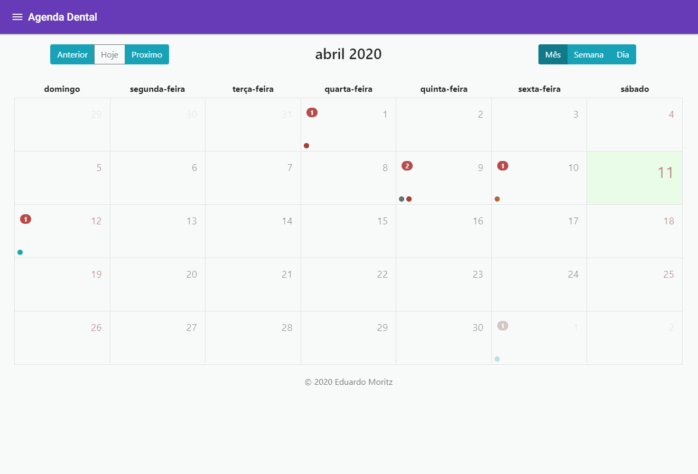

# Calendar4Web
This project was generated with [Angular CLI](https://github.com/angular/angular-cli) version 6.0.8.

## Run Front-end
``` java
"scripts": {
    "clean": "rm -rf node_modules",
    "ng": "ng",
    "start": "ng serve",
    "build": "ng build",
    "test": "ng test",
    "lint": "ng lint",
    "e2e": "ng e2e",
    "electron": "ng build && electron .",
    "backend": "cd backend && npm start",
    "pack": "electron-packager ."
  }
```
## Run Back-end
You need create the slqlite3 database with the command:
  $ knex migrate:latest

``` java
"scripts": {
    "start": "nodemon src/server.js",
    "test": "cross-env NODE_ENV=test jest"
  }
```

## Electron
If you run the electron the backend runs alone through main.js

## Demo App


## Licenses
- Copyright (C) 2020 <eduardo.moritz@hotmail.com>